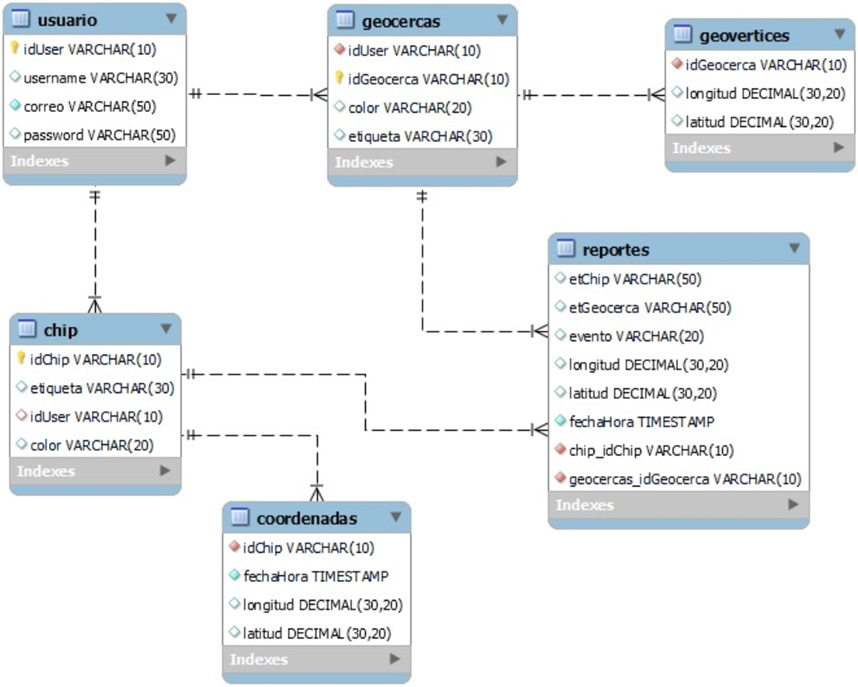

<!-- AzusSafeGeolocation -->

# SISTEMA DE GEOLOCALIZACIÓN PARA PERSONAS EN SITUACIÓN DE RIESGO MEDIANTE CHIP ESP32 Y SDK MAPBOX
### Descripcion:
El proyecto busca desarrollar un sistema de geolocalización utilizando un chip ESP32, diseñado para rastrear en tiempo real a en situación de riesgo. Este sistema brindará a los familiares y cuidadores una herramienta confiable para monitorear la ubicación, definir zonas de seguridad y recibir alertas instantáneas ante cualquier situación de riesgo. 
El sistema estará diseñado para enviar actualizaciones en tiempo real sobre la ubicación del usuario, con la capacidad de establecer zonas seguras (geocercas) y generar alertas si se detecta que la persona sale de estas áreas predefinidas. La solución se enfocará en ofrecer una herramienta intuitiva y fácil de usar, que permita a los familiares estar informados y actuar rápidamente en caso de cualquier situación de emergencia. 
El desarrollo del proyecto seguirá la metodología Extreme Programming (XP), la cual facilitará la adaptación continua a las necesidades cambiantes y garantizará la entrega de un producto que satisfaga las expectativas de los usuarios. Mediante un proceso ágil, el sistema se ajustará a los requisitos específicos y asegurará una implementación efectiva y eficiente. 
## Herramientas de desarrollo
- PHP: Para la creación de páginas web dinámicas y la gestión de la lógica del servidor.
- HTML: Estructuración de contenido de las páginas web.
- CSS: Estilización y diseño visual de la interfaz de usuario.
- JavaScript: Funcionalidades interactivas en el frontend.
- MySQL: Sistema de gestión de bases de datos para el almacenamiento de información relacionada con usuarios, geocercas, y registros de actividad.
- SDK Mapbox: Para la visualización y gestión de mapas interactivos.
- Arduino: Programación del hardware, como el ESP32, para enviar datos de geolocalización al servidor.
- ESP32: Dispositivo de hardware utilizado para capturar y enviar datos de ubicación.
### Diagrama Físico de la Base de Datos:

### Integrantes y funciones
| Integrantes  | Funciones    |
|--------------|--------------|
| Carlos Gómez Aliaga | Programador / Couch    |
| Javier Morales Gutiérrez | Electrónico    |
| Damián Aruquipa | Encargado de Pruebas    |
### Contactos
- Correo: carlosaliaga037@gmail.com

- Powered by: NextGenSolution
